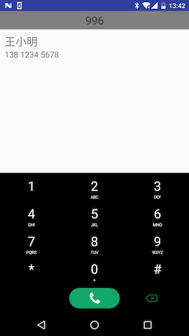

# Athena

simple search library support T9

<div align="center">
  
</div>

# How do I use?

1. Add it in your root build.gradle at the end of repositories:

```
allprojects {
     repositories {
         ...
         maven { url 'https://jitpack.io' }
     }
 }
```

1. Add the dependency

```
dependencies {
    compile 'com.github.User:Repo:Tag'
}
```

# Doc

1. set your entity as a T9 searchable entity, set parameter as searchable parameter

```java
@T9SortableEntity
public class ContactsEntity {

    @T9SearchKey // at least one search key require
    private long key;

    @T9Searchable(PinyinType = PinyinType.ALL)
    private String name;

    @T9Searchable
    private String phone;

}
```

1. init SearchDataCenter in your create

```java
//get system phone contacts in demo, you can get your custom data list here.
ContactsManager.getInstance().initData(getContentResolver());
List<ContactsEntity> contactsEntityList =  ContactsManager.getInstance().getContactsList();

//set List<Object> to SearchDataCenter data source
SearchDataCenter.getInstance().initSearchData(contactsEntityList);

SearchDataCenter.getInstance().init(this, new SearchDataCenter.OnSearchCompleteListener() {
    @Override
    public void onComplete(List<SearchableEntity> list) {
        //search result callback
    }
});
```

1. destroy SearchDataCenter in your destroy

```java
@Override
protected void onDestroy() {
    super.onDestroy();
    SearchDataCenter.getInstance().destroy();
}
```
